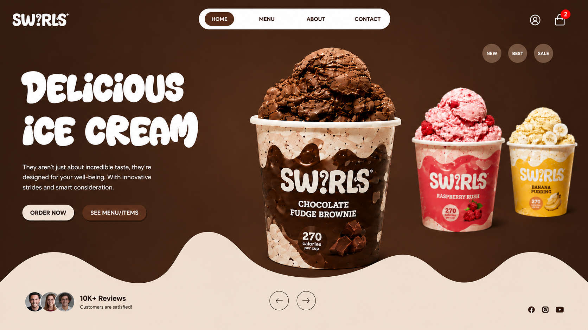

<div align="center">


**A modern, highly interactive concept landing page for *Swirls*, a luxury ice cream brand.**

Built with a focus on fluid UX, dynamic micro-interactions, custom brand aesthetics, and flavor-driven color theming.

[](https://swirls-icecream.vercel.app/)
[](https://nextjs.org/)
[](https://react.dev/)
[](https://tailwindcss.com/)
[](LICENSE)

</div>



---

## ✨ Key Features

| Feature | Description |
|---|---|
| 🎨 **Dynamic Flavor Syncing** | Hero background and UI accent colors shift live to match the selected flavor (Raspberry Rush, Banana Pudding, Caramel Crunch, Mint Dark Choco). |
| 🍦 **Interactive Flavor Finder** | A personalized quiz component that recommends custom ice cream profiles based on taste preferences. |
| 🌊 **Custom Organic Aesthetics** | Hand-crafted SVG wave section dividers, bubbly display typography, and branded tub assets. |
| ⚡ **Interactive UI Controls** | Category filtering (All Flavors, Chocolate, Berry, Fruit), quick-add buttons, rating tags, and responsive carousel controls. |
| 📱 **Fully Responsive** | Clean layout grid optimized for mobile, tablet, and desktop viewing. |

---

## 🔗 Live Demo

**[swirls-icecream.vercel.app →](https://swirls-icecream.vercel.app/)**

---

## 🛠️ Tech Stack

- **Framework:** React / Next.js
- **Styling:** Tailwind CSS / CSS Modules
- **Animations:** Framer Motion / CSS Transitions
- **Deployment:** Vercel

---

## 📁 Repository Structure

```text
swirls-icecream/
├── essentials/              # Media assets & product shots
│   ├── preview.png          # Main project showcase image
│   ├── banana.jpg           # Banana Pudding Tub
│   ├── caramel.png          # Caramel Crunch Tub
│   ├── choco.jpg            # Chocolate Fudge Brownie Tub
│   ├── mintdarkchoco.png    # Mint Dark Choco Tub
│   ├── raspberry.jpg        # Raspberry Rush Tub
│   └── strawberry.jpg       # Strawberry Bliss Tub
└── ...                      # Project source files & config
```

---

## 🚀 Getting Started

To run this project locally:

**1. Clone the repository**

```bash
git clone https://github.com/hemal0651/swirls-icecream-concept.git
cd swirls-icecream-concept
```

**2. Install dependencies**

```bash
npm install
# or
yarn install
```

**3. Run the development server**

```bash
npm run dev
# or
yarn dev
```

**4. View in browser**

Open [http://localhost:3000](http://localhost:3000) to interact with the site locally.

---

## 📄 License

This project is open-source and available under the [MIT License](LICENSE).
